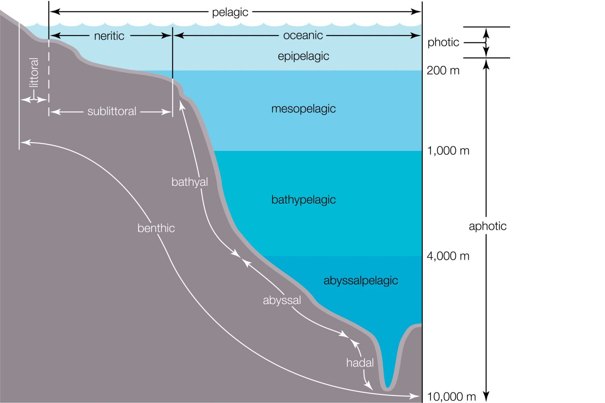

# OceanStats

OceanStats is a backend API for a set of underwater sensors. It provides simulated data for temperature, transparency, and detected fish species. The API is implemented in Go language and uses PostgreSQL as the database and Redis for caching. It also includes a Swagger specification for the API.

## Table of Contents
- [Prerequisites](#prerequisites)
- [Requirements](#requirements)
- [Setup](#setup)
- [Data Generation](#data-generation)
- [PostgresSQL Database](#postgressql-database)
- [API Endpoints](#api-endpoints)
- [Caching](#caching)
- [Swagger Documentation](#swagger-documentation)
- [Postman Collection](#postman-collection)
- [Tools Used](#tools-used)

## Requirements
The requirements for the OceanStats project are as follows:
- Generate fake data for the sensors, including temperature, transparency, and fish species counts.
- Implement an API to access the sensor data.
- Use Docker Compose to provide a convenient way to set up the project locally.
- Store the data in PostgresSQL.
- Implement a caching for some API endpoint using Redis.
- Include a Swagger specification for the API.
- Optionally, add end-to-end tests.

## Prerequisites
1. You need Go to run the OceanStats project locally. 
   - [Install Go](https://golang.org/doc/install)
2. You need Docker to run the OceanStats project locally.
   - [Install Docker](https://docs.docker.com/get-docker/)
3. PostgresSQL client.
   - [Install pgAdmin](https://www.pgadmin.org/download/)
   - [Install DataGrip](https://www.jetbrains.com/datagrip/download/#section=windows)
4. Redis client.
   - [Install Redis Desktop Manager](https://redisdesktop.com/download)
5. Install `Gin` package. It is a web framework written in Go (Golang).
   ```bash
   go get github.com/gin-gonic/gin
   ```
6. Install `Gorm` package. It is a Go ORM (Object Relational Mapper) library.
   ```bash
   go get gorm.io/gorm
   ```
7. Install `Air` package. It enables hot-reloading for a Gin server, allowing the server to automatically reload upon every file change.
   ```bash
   go install github.com/cosmtrek/air@latest
   ```
8. Install `Viper` package. It is a Go configuration library.
   ```bash
    go get github.com/spf13/viper
    ```
   
## Setup

To set up the OceanStats project locally, follow these steps:

1. Clone the repository:
   ```bash
   git clone https://github.com/danyaobertan/oceanstats.git
    ```
   
2. Navigate to the project directory:
   ```bash
   cd oceanstats
   ```
   
3. Start the project using Docker Compose:
   ```bash
    docker-compose up -d
    ```
   
4. Run the project with air:
   ```bash
    air
    ```
   The API will be accessible at http://localhost:8000.

5. Migrate the database:
   ```bash
    go run migrate/migrate.go
    ```
   
6. Generate sensor data:
   ```bash
    go run .\datagen\sensors\main.go
   ```

7. Connect to the database and add generated/provided data for sensors, sensor groups and fish species. You can use pgAdmin or DataGrip with credentials provided in the app.env file. Sql file with sensor groups and fish species is located in the assets folder.

8. Start continuous data generation for sensor observations:
   ```bash
    go run .\datagen\continious\main.go
   ```
   
## Data Generation
1. One-time "Kickoff" Phase:
   + 24 sensor groups for each greek letter names (alpha, beta, gamma, delta, epsilon, zeta, eta, theta, iota, kappa, lambda, mu, nu, xi, omicron, pi, rho, sigma, tau, upsilon, phi, chi, psi, omega).
   + Sensor groups cover all Ocean zone Epipelagic, Mesopelagic, Bathypelagic, Abyssopelagic and Trenches.

   + Fish species are taken from this page: https://oceana.org/ocean-fishes
   + Sensors coordinates are generated based on the zone they are in.
2. Regularly Repeated Phase:
   + Temperature and transparency are generated based on the zone, depth and time of the day.
   + Fish are generated based on the zone of their habitat.

## PostgresSQL Database
Migrations are made using gorm.
Database Schema:


Data are written in batches when the buffer is full\every 10 minutes:

## API Endpoints
The OceanStats API provides the following endpoints for accessing the sensor data and gathering relevant statistics:

```
GET /group/<groupName>/transparency/average: Retrieves the current average transparency inside the group.
```

```
GET /group/<groupName>/temperature/average: Retrieves the current average temperature inside the group.
```

```
GET /group/<groupName>/species: Retrieves the full list of species (with counts) currently detected inside the group.
```

```
GET /group/<groupName>/species/top/<N>: Retrieves the top N species (with counts) currently detected inside the group.
```

```
GET /region/temperature/min: Retrieves the current minimum temperature inside the specified region.
```

```
GET /region/temperature/max: Retrieves the current maximum temperature inside the specified region.
```

```
GET /sensor/<codeName>/temperature/average: Retrieves the average temperature detected by a particular sensor between the specified date/time pairs (UNIX timestamps).
```
Please refer to the Swagger specification for more details on the request/response formats of each endpoint.

Also some specific CRUD operations are also available (please refer to the Postman for more details).

## Caching
The API caches the results of the following endpoints in Redis with a TTL of 10 seconds:

```
GET /group/<groupName>/transparency/average
```

```
GET /group/<groupName>/temperature/average
```

## Swagger Documentation
The Swagger documentation for the API is available at http://localhost:8000/api/docs/index.html.
It covers statistics endpoints.

## Postman Collection
The Postman collection for the API is located in the assets folder.

## Tools Used
- Go (for the API implementation)
- Docker/Docker Compose (for local development)
- PostgresSQL (for data storage)
- Redis (for caching)
- Gin (for routing)
- Gorm (for ORM)
- Viper (for configuration)
- Swagger (for API documentation)
- Air (for live reloading)